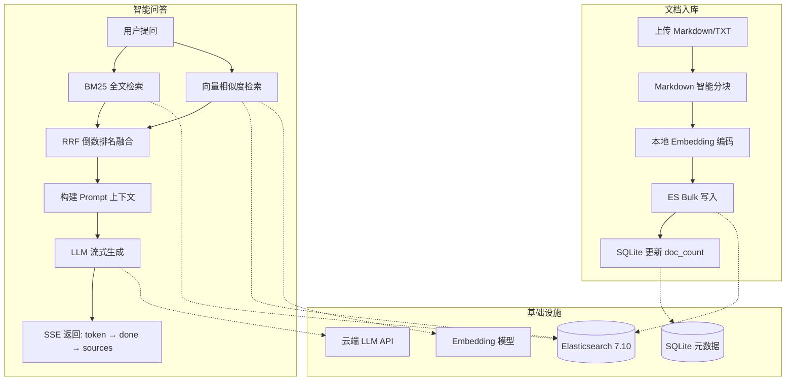
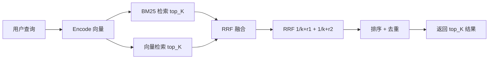

# RAG-ES-Demo

基于 Elasticsearch 7.10 的中文 RAG 问答系统，支持多知识库管理、混合检索、SSE 流式问答。

## 项目概览

### 技术栈

| 层级 | 技术选型 | 说明 |
|------|----------|------|
| **Web 框架** | FastAPI + Uvicorn | 异步 ASGI 服务器，自动生成交互式 API 文档 |
| **向量检索** | Elasticsearch 7.10 | 中文 IK 分词器 + BM25 全文检索 + script_score 向量相似度 |
| **Embedding** | BGE-Small-ZH-v1.5 | 本地 SentenceTransformer 模型，512 维向量 |
| **大语言模型** | LangChain + OpenAI 兼容协议 | 兼容任何支持 OpenAI API 格式的云端/本地 LLM |
| **元数据存储** | SQLite | 知识库名称、描述、文档计数等元数据 |
| **依赖管理** | Poetry + Conda | Python 3.10+ 环境 |
| **测试框架** | pytest + pytest-asyncio | 42 个单元测试，覆盖 chunker/retriever/service/router/schema |

### 核心流程



### 检索架构



## 特性

- **多知识库管理** — 每个知识库对应独立 ES 索引 + SQLite 元数据
- **Markdown 智能分块** — 标题层级切分 + 超长段二次切分（可配置 overlap/min/max）
- **两阶段召回 + RRF 融合** — BM25（heading-aware）+ 向量(script_score) 检索，RRF 倒数排名融合
- **SSE 流式问答** — JSON 事件流 (token → done → sources)，先回答后引用
- **入库可观测性增强** — 返回 `indexed_chunks_count`、`failed_chunks_count`、`failed_chunk_ids`
- **检索稳定性增强** — query embedding LRU 缓存、检索分支降级（单路失败可继续返回）
- **OpenAI 标准协议** — 兼容任何支持 OpenAI API 格式的云端 LLM
- **统一响应结构** — 所有接口返回 HTTP 200 + `{code, message, data}`，5 位错误码

## 前置要求

### 1. 启动 Elasticsearch (Docker Compose)

项目提供 `docker-compose.yml`，一键启动 ES 7.10：

```bash
docker compose up -d
```

配置说明：
- 端口: `9200`
- 用户: `elastic` / 密码: `Cass@123456`
- 数据目录: `./data` 挂载到容器
- 插件目录: `./plugins` 挂载到容器（用于 IK 分词器）
- 内存: 2-3GB (`ES_JAVA_OPTS=-Xms2g -Xmx3g`)

停止服务：
```bash
docker compose down
```

### 2. 安装 IK 分词器

ES 7.10 需要 `analysis-ik` 插件才能正确进行中文分词。

#### 自动安装（推荐）

```bash
# 创建插件目录
mkdir -p plugins

# 下载 IK 分词器压缩包
curl -L -o plugins/analysis-ik.zip https://get.infini.cloud/elasticsearch/analysis-ik/7.10.0

# 解压到 plugins/analysis-ik/ 目录
unzip plugins/analysis-ik.zip -d plugins/analysis-ik/

# 确保权限正确
chmod -R 755 plugins/analysis-ik/
```

> 由于 `docker-compose.yml` 已将 `./plugins` 挂载到容器，解压后重启 ES 即可自动加载。

#### 重启 ES 加载插件

```bash
docker compose restart es
```

#### 验证 IK 分词器是否生效

```bash
# 检查已安装的插件列表
curl -s -u elastic:Cass@123456 http://localhost:9200/_cat/plugins?v

# 预期输出中包含 analysis-ik：
# name   component        version
# es     analysis-ik      7.10.0

# 测试分词效果
curl -s -u elastic:Cass@123456 -X POST "http://localhost:9200/_analyze?pretty" \
  -H "Content-Type: application/json" \
  -d '{"analyzer": "ik_max_word", "text": "北京清华大学"}'

# 预期分词结果：["北京", "清华", "清华大学", "华大", "大学"]
```

> 如果 `/_cat/plugins` 中没有 `analysis-ik`，说明插件未加载成功，请检查 `plugins/analysis-ik/` 目录结构是否正确。

### 3. Embedding 模型

本地模型已包含在仓库 `data/models/bge-small-zh-v1.5/` 目录，无需额外下载。

## 快速开始

### 1. 安装依赖

```bash
conda activate rag-es-demo
poetry install
```

### 2. 配置环境变量

复制并编辑 `.env` 文件：

```bash
cp .env.example .env
```

修改 `LLM_BASE_URL` 和 `LLM_API_KEY` 为你的云端 LLM 配置。

### 3. 启动服务

```bash
poetry run uvicorn app.main:app --host 0.0.0.0 --port 8000 --reload
```

服务启动后访问：

- API 文档: http://localhost:8000/docs
- 健康检查: http://localhost:8000/health

## API 端点

所有接口统一前缀 `/rag/api/v1`，返回格式 `{code, message, data}`，HTTP 状态码始终为 200。

| 方法   | 路径                                  | 描述                                   |
| ------ | ------------------------------------- | -------------------------------------- |
| POST   | `/rag/api/v1/kb`                      | 创建知识库                             |
| GET    | `/rag/api/v1/kb`                      | 列出所有知识库                         |
| GET    | `/rag/api/v1/kb/{kb_id}`              | 知识库详情                             |
| DELETE | `/rag/api/v1/kb/{kb_id}`              | 删除知识库                             |
| POST   | `/rag/api/v1/kb/{kb_id}/upload`       | 上传 Markdown/TXT 文件入库             |
| POST   | `/rag/api/v1/kb/{kb_id}/search`       | 检索（返回 JSON）                      |
| POST   | `/rag/api/v1/kb/{kb_id}/chat`         | SSE 智能问答（返回 text/event-stream） |

### 响应格式

```json
{
  "code": 10000,
  "message": "成功",
  "data": { ... }
}
```

### Upload 响应示例

```json
{
  "code": 10000,
  "message": "成功",
  "data": {
    "doc_id": "abc123",
    "filename": "test.md",
    "chunks_count": 2,
    "indexed_chunks_count": 2,
    "failed_chunks_count": 0,
    "failed_chunk_ids": []
  }
}
```

### 错误码

| 代码    | 说明                   |
| ------- | ---------------------- |
| 10000   | 成功                   |
| 10001   | 通用失败               |
| 10002   | ES 连接失败            |
| 10003   | ES 创建索引失败        |
| 10004   | ES 操作失败            |
| 10100   | 仅支持 .md/.txt 文件   |
| 10101   | 知识库不存在           |
| 10102   | 知识库已存在           |
| 10103   | 知识库删除失败         |
| 10104   | 知识库创建失败         |
| 10200   | 检索失败               |
| 10201   | 查询参数无效           |
| 10300   | LLM 调用失败           |
| 10301   | 问答超时               |
| 10302   | 无参考资料             |

### SSE 事件格式

问答接口返回 Server-Sent Events 流，每个事件统一包装为 `{code, message, data}`：

```
# 流式 token
{"code": 10000, "message": "成功", "data": {"type": "token", "content": "根据..."}}

# 回答完成
{"code": 10000, "message": "成功", "data": {"type": "done", "content": {"answer": "...", "sources": [...]}}}

# 引用文档（最后发送）
{"code": 10000, "message": "成功", "data": {"type": "sources", "content": [{"doc_id": "...", "filename": "...", ...}]}}

# 错误事件
{"code": 10300, "message": "LLM 调用失败", "data": {"type": "error", "content": {"message": "..."}}}
```

## 项目结构

```
rag-es-demo/
├── app/
│   ├── main.py                  # FastAPI 应用入口
│   ├── config.py                # Pydantic 配置管理
│   ├── core/
│   │   ├── es_client.py         # ES 异步客户端 (v7 专用)
│   │   ├── embedder.py          # 本地 Embedding 模型
│   │   ├── kb_store.py          # SQLite 知识库元数据存储
│   │   ├── error_codes.py       # 5 位错误码定义
│   │   └── response.py          # 统一 ApiResponse 响应结构
│   ├── chunkers/
│   │   └── markdown_chunker.py  # Markdown 标题级分块器
│   ├── retrievers/
│   │   ├── bm25_retriever.py    # heading-aware BM25 检索
│   │   ├── vector_retriever.py  # 向量相似度检索 (script_score + query cache)
│   │   └── hybrid_retriever.py  # RRF 混合检索融合 + 失败降级
│   ├── services/
│   │   ├── ingest_service.py    # 文档入库流水线
│   │   └── chat_service.py      # SSE 流式问答
│   ├── routers/
│   │   ├── knowledge_base.py    # KB CRUD 端点
│   │   ├── upload.py            # 文件上传端点
│   │   ├── search.py            # 检索端点
│   │   └── chat.py              # SSE 聊天端点
│   └── schemas/
│       ├── request.py           # 请求模型
│       └── response.py          # 响应模型
├── tests/                       # 单元测试
├── data/
│   ├── models/bge-small-zh-v1.5/  # 本地 Embedding 模型
│   └── kb_store.db              # SQLite 元数据 (运行时生成)
├── docker-compose.yml           # ES 容器编排
├── pyproject.toml               # Poetry 依赖管理
└── .env                         # 环境变量
```

## 测试

```bash
# 运行全部测试
poetry run pytest tests/ -v

# 运行单个测试文件
poetry run pytest tests/test_routers/test_upload.py -v

# 查看覆盖率
poetry run pytest --cov=app --cov-report=term-missing
```

测试特点：
- router 测试基于 `httpx.AsyncClient + ASGITransport`，避免真实网络与服务依赖
- 测试 app 会覆盖 lifespan（不连接真实 ES，不加载真实 embedding）
- ES 相关服务通过 `mock.patch` 模拟
- 纯逻辑测试（chunker、RRF）无需任何依赖

## 架构

```
FastAPI → [KB Store (SQLite) | IngestService | RetrieverService | ChatService]
                                            ↓
                    ES 7.10 (script_score + IK) + 本地 Embedding + 云端 LLM
```

## 关键设计决策

| 决策 | 选择 | 原因 |
|------|------|------|
| ES 客户端版本 | elasticsearch-py **v7** | v8 与 ES 7.x 不兼容 |
| 向量检索方式 | `script_score` + `cosineSimilarity` | ES 7.10 无原生 kNN |
| 健康检查 | `info()` 而非 `ping()` | `ping()` 在 v8 客户端对 ES 7.x 不可靠 |
| 分词器 | `ik_max_word` | 中文细粒度分词，提升检索召回率 |
| 融合算法 | RRF (k=60) | 无需归一化，对 score 差异鲁棒 |
| 知识库元数据 | SQLite | 轻量，无额外服务依赖 |
| 向量查询缓存 | 进程内 LRU | 降低重复 query 的编码开销 |
